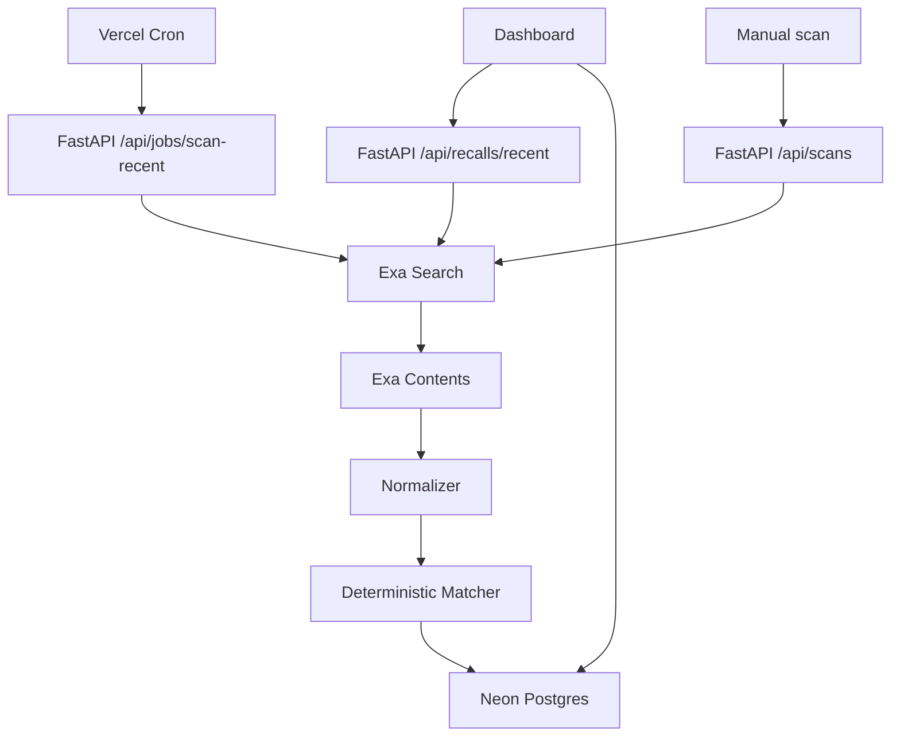

# Architecture

Exa owns discovery and extraction. RecallScan owns source normalization, signal fingerprints, catalog matching, inventory impact, idempotency, and the recall-team workflow.

## Request Flow

1. Dashboard calls `GET /api/recalls/recent?days=365`.
2. API startup applies SQL migrations and creates the starter catalog only if the catalog table is empty.
3. If there are no recent signals, API runs a bootstrap Exa scan.
4. Exa Search discovers recent recall and supplier-cascade sources.
5. Exa Contents enriches known URLs with highlights and a structured summary schema.
6. RecallScan normalizes sources and signals, computes fingerprints, and upserts rows.
7. The matcher assigns deterministic triage tiers.
8. The UI renders the signal inbox and evidence drawer.

## Reliability Choices

- Canonical source URLs prevent duplicate source cards.
- Signal fingerprints prevent duplicate recall events.
- Manual scans use `Idempotency-Key`.
- Job locks prevent overlapping scans.
- Vercel Cron provides scheduled refresh without a long-running worker.
